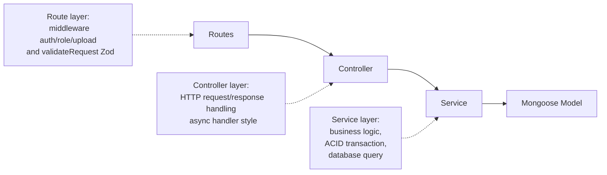

# Backend SehatMurah - Doctor Appointment API

## Project Overview

This backend is a REST API service for a Doctor Appointment system that handles authentication, doctor and patient data management, appointment booking, specialist management, reviews, and user administration.

The backend architecture is designed as a Modular Monolith so each feature has clear responsibility boundaries while still running in a single codebase and a single deployment unit.

## Main Tech Stack

| Component                   | Technology                | Purpose                                          |
| --------------------------- | ------------------------- | ------------------------------------------------ |
| Runtime and Package Manager | Node.js + NPM             | Runs the server and manages dependencies         |
| Web Framework               | Express.js 5 + TypeScript | HTTP routing, middleware, and application layers |
| Database                    | MongoDB + Mongoose        | Data storage and ODM schema modeling             |
| Data Validation             | Zod                       | Validates request body, params, and query        |
| File Upload                 | Multer                    | Handles image/icon/profilePhoto uploads          |

## Architecture and System Design

### Modular Monolith Pattern

Core features are grouped in the src/modules folder so each domain stays isolated and easier to maintain:

- auth
- doctors
- appointments
- patients
- reviews
- specialists
- users

Meanwhile, global cross-module database schemas are placed in src/models to keep data relationships consistent.

### Separation of Concerns Flow

Each request is processed through the following layer flow:



Layer breakdown:

1. Routes

- Maps endpoints to middleware and controllers.
- Applies validation using validateRequest with Zod schemas from .schema.ts files.

2. Controller

- Focuses on HTTP concerns: read request, call service, and send consistent responses via HttpResponse.
- Uses an async handler style without repetitive try-catch blocks. In Express 5, errors thrown from async functions flow into centralized error middleware.

3. Service

- Contains all business logic.
- Executes Mongoose queries.
- Handles ACID transactions using mongoose sessions for critical multi-step processes, such as register and create doctor.

4. Mongoose Model

- Defines global schemas for User, PatientProfile, DoctorProfile, Appointment, Review, and Specialist.

## Current Source Structure

```txt
src/
|-- app.ts
|-- server.ts
|-- common/
|   |-- api-error.ts
|   |-- format-zod-error.ts
|   |-- http-response.ts
|   |-- pagination.ts
|   |-- permissions.ts
|   \-- enums/
|       |-- appointment-status.enum.ts
|       |-- gender.enum.ts
|       \-- user-role.enum.ts
|-- config/
|   |-- database.ts
|   \-- env.ts
|-- middlewares/
|   |-- auth.middleware.ts
|   |-- error.middleware.ts
|   |-- map-file-to-body.middleware.ts
|   |-- role.middleware.ts
|   |-- upload.middleware.ts
|   \-- validate-request.middleware.ts
|-- models/
|   |-- appointment.model.ts
|   |-- doctor-profile.model.ts
|   |-- patient-profile.model.ts
|   |-- review.model.ts
|   |-- specialist.model.ts
|   \-- user.model.ts
|-- modules/
|   |-- appointments/
|   |   |-- appointment.controller.ts
|   |   |-- appointment.routes.ts
|   |   |-- appointment.schema.ts
|   |   \-- appointment.service.ts
|   |-- auth/
|   |   |-- auth.controller.ts
|   |   |-- auth.routes.ts
|   |   |-- auth.schema.ts
|   |   \-- auth.service.ts
|   |-- doctors/
|   |   |-- doctor.controller.ts
|   |   |-- doctor.routes.ts
|   |   |-- doctor.schema.ts
|   |   \-- doctor.service.ts
|   |-- patients/
|   |   |-- patient.controller.ts
|   |   |-- patient.port.ts
|   |   |-- patient.routes.ts
|   |   |-- patient.schema.ts
|   |   \-- patient.service.ts
|   |-- reviews/
|   |   |-- review.controller.ts
|   |   |-- review.routes.ts
|   |   |-- review.schema.ts
|   |   \-- review.service.ts
|   |-- specialists/
|   |   |-- specialist.controller.ts
|   |   |-- specialist.routes.ts
|   |   |-- specialist.schema.ts
|   |   \-- specialist.service.ts
|   \-- users/
|       |-- user.controller.ts
|       |-- user.routes.ts
|       |-- user.schema.ts
|       \-- user.service.ts
|-- seeders/
|   |-- index.ts
|   \-- factories/
|       |-- appointment.factory.ts
|       |-- doctor-profile.factory.ts
|       |-- patient-profile.factory.ts
|       |-- review.factory.ts
|       |-- specialist.factory.ts
|       \-- user.factory.ts
|-- types/
|   |-- auth-user.type.ts
|   \-- express.d.ts
\-- utils/
    |-- delete-upload-file.ts
    |-- escape-regex.ts
    |-- generate-booking-code.ts
    |-- jwt.ts
    |-- normalize-email.ts
    |-- password.ts
    |-- to-upload-url.ts
    |-- upload-dir.ts
    \-- uploaded-file-request.ts
```

## API Convention for HTTP Methods

Data update rules used in this API:

1. PUT for full resource updates

- Example implementations: update doctor profile, update specialist, update patient profile, and update user.

2. PATCH for specific field modifications

- Example implementations: update appointment status, update doctor schedule, and deactivate or activate an account through the isActive field.

This principle keeps the API explicit: PUT for replace semantics, PATCH for partial semantics.

## Validation and Error Handling

### validateRequest Middleware

The validateRequest middleware performs Zod-based validation and sanitizes data before it reaches the controller:

1. A valid body is written back to req.body.
2. Valid params are extracted to req.sanitizedParams.
3. Valid query values are extracted to req.sanitizedQuery.

Benefits:

- Controllers receive pre-validated data.
- Parsing and coercion are not scattered across controller/service layers.
- Validation errors are consistent with the VALIDATION_ERROR code format.

### async Controller Pattern

Controllers use async functions to keep request handling concise without repetitive try-catch boilerplate in each handler. Errors from async flows are forwarded to the global error handler in a centralized way.

### Global Error Middleware

error.middleware.ts handles all application errors, including:

- ApiError for structured business errors
- ZodError for validation errors
- MongoDB duplicate key errors
- Multer upload errors
- Internal server error fallback

Production security behavior:

- In production, internal err.message details are not exposed to clients for unknown errors.
- 500 responses use the generic message Internal server error.

## Security and Authentication Policy

Latest security policy updates for account status:

1. Login Guard by isActive

- Users with isActive set to false are blocked from login.
- The system returns Unauthorized with an account-disabled message.

2. Token Access Guard in authMiddleware

- Every private endpoint verifies the JWT token.
- After token verification, middleware still checks user status in the database.
- If the user is not found or is inactive, endpoint access is denied.

Security implications:

- Old tokens belonging to inactive accounts can no longer be used.
- Reduces the risk of unauthorized access by disabled accounts.

## Core Principles in This Backend

- Modular monolith domain-driven foldering.
- Strict separation of concerns between route, controller, service, and model.
- Validation first using Zod before business logic executes.
- Centralized error handling with message sanitization in production.
- Consistent HTTP semantics between PUT and PATCH.
- Active account enforcement for login and protected endpoint access.
