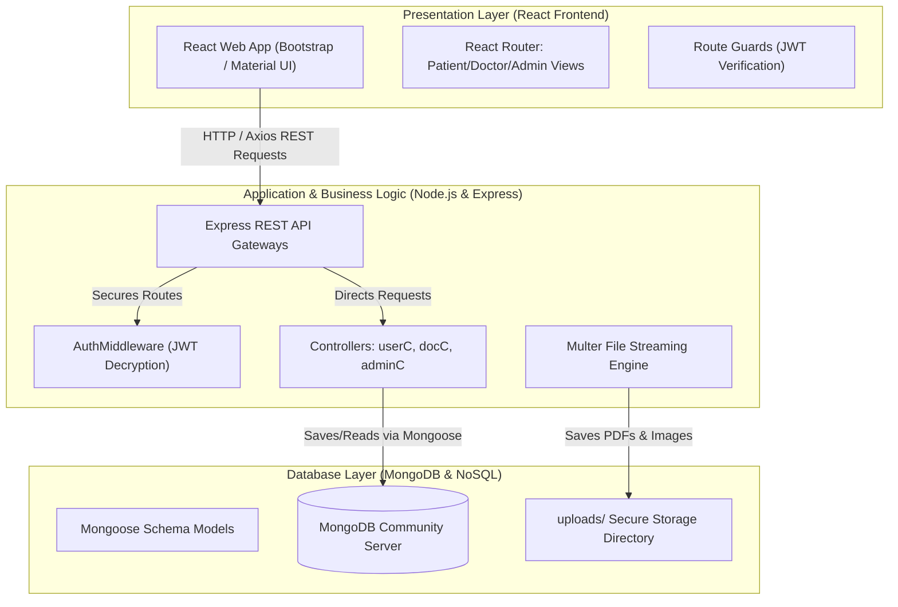
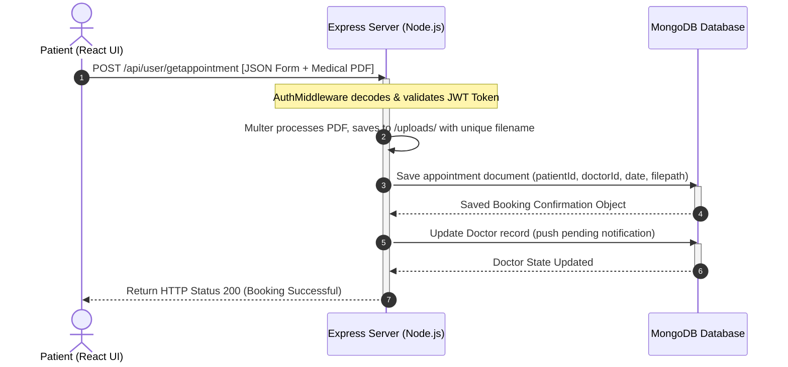

# Kumpulan Prompt Generate Gambar/Diagram Solusi Arsitektur SehatMurah

Dokumen ini berisi kumpulan prompt (dalam bahasa Inggris untuk hasil optimal) yang siap digunakan pada berbagai AI Image Generators (seperti **DALL-E 3**, **Midjourney**) untuk menghasilkan gambar ilustrasi konseptual 3D yang premium, serta kode/prompt untuk diagramming tools (**Mermaid**, **Miro AI**, **Eraser.io**) untuk diagram teknis.

---

### **1. Prompt Konseptual 3D Isometric (DALL-E 3 / Midjourney)**
*Gunakan prompt ini pada DALL-E 3 (melalui ChatGPT Plus / Bing Image Creator) atau Midjourney untuk menghasilkan ilustrasi arsitektur 3D yang modern, estetik, dan premium untuk disisipkan ke dalam dokumen desain.*

* **Prompt:**
  ```text
  A premium, high-resolution 3D isometric technical illustration representing a secure clinical web application architecture named 'SehatMurah'. 
  The illustration should display three distinct interconnected layers on a clean dark slate-grey background, using a clinical color palette of deep teal (#0e7490), bright medical blue, and clean white accents.

  - On the Left (Client Tier): A floating translucent glass card showing a sleek web browser interface containing a doctor search searchbar, calendar slots, and appointment booking forms.
  - In the Center (Application Tier): A glowing translucent server rack icon representing an API Gateway and Node.js/Express.js backend server. Highlight a glowing key icon labeled 'JWT' and a folder icon labeled 'Multer'.
  - On the Right (Database Tier): A cylindrical glowing database icon labeled 'MongoDB' and a small digital safety locker cabinet next to it labeled '/uploads' representing secure document storage.
  
  Sleek glowing teal fiber-optic data transfer lines connect the Web Browser card to the Server Rack, and the Server Rack to the Database and Locker. 
  Minimalist, vector style, soft ambient lighting, clean glassmorphism, professional tech presentation slide graphic, no realistic human characters.
  ```

---

### **2. Prompt Diagram Blok Teknis (Miro AI / Eraser.io / Diagram Copilot)**
*Gunakan prompt ini pada Miro AI ("Generate Diagram" atau "Generate Board") atau Eraser.io Diagram Copilot untuk menghasilkan diagram blok arsitektur 3-tier secara terstruktur.*

* **Prompt:**
  ```text
  Create a professional 3-Tier Client-Server System Architecture diagram for the 'SehatMurah Doctor Appointment Platform'. Group the system into three horizontal layers using a clinical color scheme (Teal, Slate Grey, Light Grey):

  1. Layer 1: 'Presentation Layer (React Frontend)' containing blocks:
     - "React SPA Web Application"
     - "React Router (Private & Public Routes)"
     - "JWT Route Guards (Client-Side Verification)"
     - "Axios HTTP Client (REST Requests)"

  2. Layer 2: 'Application Layer (Node.js & Express)' containing blocks:
     - "Express REST API Gateway"
     - "JWT Auth Middleware (Signature Verification)"
     - "Multer File Upload Engine (Multipart Form Data)"
     - "Controllers (userController, docController, adminController)"

  3. Layer 3: 'Database & Storage Layer (MongoDB)' containing blocks:
     - "Mongoose Database Models"
     - "MongoDB Collections (users, doctors, appointments)"
     - "uploads/ Secure Storage Directory"

  Draw direct directional arrows:
  - React SPA Web Application -> sends HTTP REST requests to -> Express REST API Gateway
  - Express REST API Gateway -> verifies token via -> JWT Auth Middleware
  - Express REST API Gateway -> processes file via -> Multer File Upload Engine
  - Multer File Upload Engine -> saves files to -> uploads/ Secure Storage Directory
  - Controllers -> reads/writes data via Mongoose to -> MongoDB Collections
  ```

---

### **3. Kode Diagram Mermaid (Untuk Markdown / GitHub / Notion)**
*Jika Anda ingin menyisipkan diagram interaktif yang langsung me-render dalam format text-to-diagram (seperti di GitHub / Obsidian / Notion), Anda dapat menyalin kode Mermaid berikut.*

#### **A. Diagram Blok Arsitektur 3-Tier**


#### **B. Diagram Alir Data Transaksi Booking (Sequence Diagram)**


---

### **Langkah Penyelesaian & Pengambilan Screenshot**
1. **Untuk Ilustrasi 3D (DALL-E 3 / Midjourney):**
   * Masukkan prompt **No. 1** ke generator gambar pilihan Anda.
   * Pilih variasi gambar terbaik yang paling bersih dan memiliki teks paling akurat.
   * Unduh gambar, ubah namanya menjadi `sehatmurah_system_architecture.png` dan simpan di folder `deliverables/need-to-submit-phase-wise-template/Project Design Phase/images/`.
   
2. **Untuk Diagram Blok/Alur (Miro / Mermaid):**
   * Gunakan diagram Mermaid di atas secara langsung di markdown, atau impor ke Mermaid Live Editor untuk diekspor sebagai file SVG/PNG beresolusi tinggi.
   * Simpan gambarnya di folder gambar lokal dan referensikan dalam berkas `Solution Architecture.md`.
