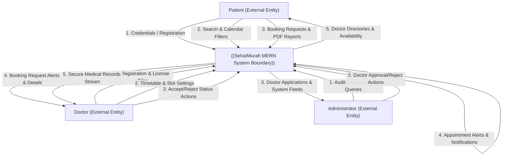
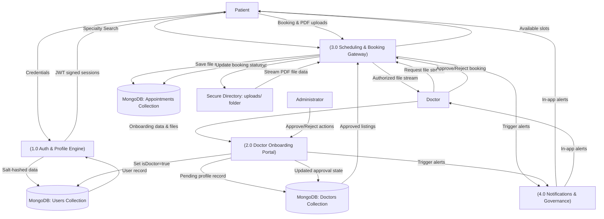

**Project Design Phase-II**  
**Data Flow Diagram & User Stories - SehatMurah Doctor Appointment Platform**

| Date | 2 June 2026 |
| :---- | :---- |
| Team ID | SehatMurah Development Team |
| Project Name | SehatMurah - Doctor Appointment MERN Web Application |
| Maximum Marks | 4 Marks |

---

# Data Flow Diagrams & Agile User Stories

## 1. Data Flow Diagrams (DFD)

A **Data Flow Diagram (DFD)** is a standard visual representation of how data moves through the system, identifying the external entities, data stores, processing nodes, and incoming/outgoing data flows. For the **SehatMurah Doctor Appointment Platform**, our data flow is designed to enforce role-based access controls and secure medical file streams.

Below is a conceptual illustration of the system's unstructured file and transaction processing flows:

**![Simplified SehatMurah System DFD Layout][image1]**

*Figure 1: Simplified Conceptual Information Processing Flow.*

---

### 1.1. DFD Level 0: Context Diagram

The Context Diagram defines the boundary of the SehatMurah system. It illustrates the external entities (Patients, Doctors, Administrators) and their high-level data inputs and outputs.



---

### 1.2. DFD Level 1: Process Decomposition Diagram

The Level 1 DFD decomposes the system boundary into four core functional processes, mapping how data interacts with MongoDB Mongoose collections.



---

### 1.3. DFD Level 2: Secure Document Upload & Streaming Process

The Level 2 DFD details the precise data operations that occur during process **(3.0 Scheduling & Booking Gateway)** to securely upload and retrieve medical records (PDFs/Images) using Express Multer and MongoDB data mapping.

```mermaid
graph TD
    Patient["Patient"]
    Doctor["Doctor"]
    Multer["[Multer Middleware Gateway]"]
    AppSchema["[Appointment Controller Schema]"]
    Stream["[Document Streaming Engine]"]
    
    D3[("MongoDB: Appointments Collection")]
    D4["Secure Directory: uploads/ folder"]

    %% Upload Flow
    Patient -->|1. Submit Booking + PDF| Multer
    Multer -->|2. Hash filename & Save binary| D4
    Multer -->|3. Pass file-path & Booking metadata| AppSchema
    AppSchema -->|4. Create mapping record| D3
    AppSchema -->>Patient: 5. Return Booking Confirmation

    %% Download Flow
    Doctor -->|6. Dispatch GET with JWT token| Stream
    Stream -->|7. Verify assigned doctor role| D3
    D3 -->|8. Return document path| Stream
    Stream -->|9. Fetch binary file data| D4
    D4 -->|10. Read binary stream| Stream
    Stream -->|11. Authorized file stream| Doctor
```

---

## 2. Agile User Stories

Below is the complete list of User Stories for the SehatMurah platform, categorized by user types (Patients, Doctors, Administrators) and distributed across the 4 Sprints based on logical system dependencies.

| User Type | Functional Requirement (Epic) | User Story Number | User Story / Task | Acceptance Criteria | Priority | Release |
| :--- | :--- | :--- | :--- | :--- | :---: | :--- |
| **Patient** | Authentication | **USN-1** | As a patient, I can sign up for the application by entering my email and a secure password so that I can create a secure account. | The system hashes the password with Bcrypt and returns a successful registration response. | High | Sprint-1 |
| **Patient** | Authentication | **USN-2** | As a patient, I can log into the application using my credentials so that my session remains authenticated. | The backend verifies password credentials, signs a secure JWT, and grants access. | High | Sprint-1 |
| **Patient** | Profile Setup | **USN-3** | As a patient, I can set up and edit my clinical profile (name, phone, medical history) so my details are ready for booking appointments. | User data is committed to MongoDB `users` collection and reflects live on the React profile page. | Medium | Sprint-1 |
| **Doctor** | Onboarding | **USN-4** | As a doctor applicant, I can submit my professional registration application (specialty, fee, experience, address) so the admin can review my credentials. | Node.js creates a `doctorSchema` record with `status: "pending"` and alerts administrative feeds. | High | Sprint-1 |
| **Doctor** | Schedule Setup | **USN-5** | As an approved doctor, I can configure my weekly availability timings so patients can see when I am free to consult. | The system updates the doctor timings array in MongoDB, which reflects live on the patient booking calendar. | High | Sprint-2 |
| **Admin** | Verification | **USN-6** | As an administrator, I can view, approve, or reject pending doctor applications so that only certified medical providers are active. | Approving changes doctor status to `"approved"`, sets `user.isdoctor = true`, and notifies the doctor. | High | Sprint-2 |
| **Patient** | Search & Discovery | **USN-7** | As a patient, I can search and filter approved doctors by specialty, location, and fees so I can select the best provider. | React Patient dashboard fetches only doctors with status `"approved"` using specialty/fee filter arguments. | High | Sprint-2 |
| **Patient** | Booking & Uploads | **USN-8** | As a patient, I can book an appointment for a specific slot and upload my clinical PDF/images so my doctor can review them. | Multer stores the PDF securely in `/uploads/` and links the file path to a new `appointmentSchema` record. | High | Sprint-3 |
| **Doctor** | Document Streaming| **USN-9** | As a doctor, I can securely download/stream the clinical files attached to my bookings to review patient history. | The API verifies that the requester is the assigned doctor, reads the file from `/uploads/`, and streams it. | High | Sprint-3 |
| **Patient** | Alerts & Feed | **USN-10**| As a patient, I can view my in-app notification feed to receive real-time alerts whenever a doctor updates my booking status. | Updates to the booking collection automatically trigger database changes that populate the patient's notification feed. | Medium | Sprint-3 |
| **Doctor** | Queue Management | **USN-11**| As a doctor, I can view all my scheduled bookings on my private dashboard and update their status (Approve/Reject) in real-time. | Status changes update the database state and dispatch notifications to the respective patient. | High | Sprint-4 |
| **Admin** | Governance | **USN-12**| As an administrator, I can monitor all registered users, active doctors, and historical booking transactions in a single dashboard. | Admin gains a unified view of all database collections, facilitating easy audits and troubleshooting. | Medium | Sprint-4 |

---

## 3. Appendix: DFD Diagram Drawing Procedures & Reference Guidelines

To represent these data flows visually in your final submission, follow the detailed instructions and reference standards below to capture and draw clean, professional Data Flow Diagrams.

### Recommended DFD Diagram Formats
1.  **DFD Level 0 (Context Diagram):** Highlighting Patient, Doctor, and Admin interactions with the main system boundary.
2.  **DFD Level 1 (Process Breakdown):** Detailing the flow between processes (1.0 to 4.0) and Mongoose collections.
3.  **DFD Level 2 (Secure Document Streaming):** Visualizing the path of a clinical file from Multer to MongoDB and Node streaming response.

---

### Procedure for Drawing DFD Diagrams

We recommend using vector-based drawing software such as **Draw.io (diagrams.net)**, **Lucidchart**, **Figma**, or **Visual Paradigm** (Agile/Scrum module). Follow these steps to ensure professional rendering:

#### Step 1: Utilize Standard DFD Notations
Choose a consistent notation set before drawing:
*   **Yourdon and Coad Notations:**
    *   *Processes:* Circles/Ovals.
    *   *Data Stores:* Parallel horizontal lines.
    *   *External Entities:* Rectangles.
    *   *Data Flows:* Directed arrows with descriptive text.
*   **Gane and Sarson Notations:**
    *   *Processes:* Rounded rectangles.
    *   *Data Stores:* Flat open-ended rectangles.
    *   *External Entities:* Double-bordered squares.

#### Step 2: Establish the Flow Hierarchy
*   **DFD Level 0 (Context):** Place the single system process in the center. Position external entities on the left (inputs/Patients) and right (outputs/Doctors/Admins). Ensure all major input/output boundaries are clear.
*   **DFD Level 1:** Break down the system circle into distinct subprocesses (Auth, Onboarding, Bookings, Notifications). Place data stores (MongoDB collections) in the middle, showing how processes read/write to them.
*   **DFD Level 2:** Select a single complex process (e.g., Process 3.0 Booking Gateway) and map its detailed database and local directory file stream reads/writes.

#### Step 3: Brand & Palette Alignment
*   Align the colors of the diagram with the **SehatMurah brand identity**:
    *   *System Processes:* HSL Teal (`#0e7490`) representing safe, clinical execution.
    *   *External Entities:* Dark Slate Gray (`#1e293b`) with white text.
    *   *Data Stores (MongoDB collections):* Crisp Grey (`#f8fafc`) with Slate borders (`#475569`).
*   Keep connection lines straight, avoiding awkward diagonals. Route data flow paths around shapes.

#### Step 4: Exporting
*   Export the completed diagrams in high-density **PNG** (at minimum `@2x` scale) or vector **SVG** format to ensure crisp text reading.

---

### DFD Reference & Capture Guidelines

*   **File Format:** Save all visual diagrams in lossless PNG or vector SVG format. Never save tech diagrams as compressed JPEGs, as text lines will become blurry.
*   **File Naming Conventions:** Keep names lowercase and use snake_case, e.g., `sehatmurah_dfd_level0.png`, `sehatmurah_dfd_level1.png`, `sehatmurah_dfd_level2.png`.
*   **Graphic Integrity:** Maintain high text-to-background contrast (at least 4.5:1 ratio) on all nodes. Avoid drop shadows that interfere with shapes.
*   **Workspace Saving:** Store all diagram images in the local workspace directory (`deliverables/need-to-submit-phase-wise-template/Requirement Analysis/images/`) before referencing them in this Markdown document.

---

References:

1. [https://developer.ibm.com/patterns/visualize-unstructured-text/](https://developer.ibm.com/patterns/visualize-unstructured-text/)  
2. [https://www.atlassian.com/agile/tutorials/sprints](https://www.atlassian.com/agile/tutorials/sprints)  
3. [https://www.atlassian.com/agile/tutorials/epics](https://www.atlassian.com/agile/tutorials/epics)  
4. [https://www.atlassian.com/agile/tutorials/burndown-charts](https://www.atlassian.com/agile/tutorials/burndown-charts)

---

[image1]: <data:image/png;base64,iVBORw0KGgoAAAANSUhEUgAAATgAAAEPCAYAAADWANh/AAAs+0lEQVR4Xu2djXMVZb7n71+wtXd362zdqZ29VVO3at8yW3fnWuvUdceZ0a2xyOzVITt4Z5DyDncsi13uLdnRwQBCRCUEFYKAAeVNxaCiiYBBxcCABhA4yEuQFyNvCQQ48nYgIZwkhN+e39P9dD/9dJ+TPn3S56Xz/aS6uvvpp9+7P3mePv38+s8IAAAiyp/pCQAAEBUgOABAZIHgAACRBYIDAESW0AUXi8Xo1q1bejIAAIROzoJjYQ3X6fkhOABAMQgsOL9AcACAYgHBAQAiS1EFNzQ0RI8//rjIM2fOHH0yAADkRdEE98gjj4hpnZ2dYvzTTz8V4y0tLY58kydPpmXLljnSmC+++CLjdnD69evX9WQAwCijKILbtm0b/ehHP3KkSTh/f3+/NX7x4kXP9f3whz+k3//+97R9+3Z9kmd+AMDooyiC+8EPfmCV3HRmzJhBdXV1jjSv9XHawYMH6Xe/+50jndfllR8AMPoILLhM3QcffODKrwsum4B6enpc03l8YGDAGr99+7YowclpKgsXLqQFCxY40gAAo5PAgvOLLjgW1XDz69NnzpxJb775pjW+dOlSq2qqy08fBwCMXgouOD9VSH26XqpThxsbGx0lNn1eAMDopeCCk2nZ8JqeSXB37tyxxi9cuEC//OUvrWkAgNFNyQnu7NmzntN//OMf05UrV2jPnj2uZ2wy/1NPPUVHjhxxTAMAjF6KIjj+5ZN/DPCCXx/Zv3+/nizExgJj0enP2Dg923txAIDRSVEEJ9Pff/99R9rDDz+c8f04JtO6+Rkd/6rqNQ0AMHoJXXBdXV0Z53nwwQetadx5tVhQ4Ty/+c1v9GQBT9PfnwMAjG5yFhwAAJQLEBwAILJAcACAyALBAQAiCwQHAIgsEBwAILJAcACAyALBAQAiCwQHAIgsEBwAILJAcACAyALBAQAiCwQHAIgsEBwAILJAcACAyALBAQAiCwQHAIgsEBzIm/nz5+tJwAeLFy/Wk8AIE0nBrV61mna07aD5L8+nq1ev0qJXFtGJEydo185dYjoPg5EjqOBeeP4Fx3hzU7Pov7bsNdr/1X6qfrpadMwrC19Rs0aCoILr6+uzhvna9qK52TiW/MmAvXv30u4vd9P0adNpcHCQnpv9nJY7ukRScNOqp9Hc2rni5jh58qS4COLxuCW406dPO2cAeRFUcNu3bRc3XyqVEuent7dX9K9du0YvznvREhyn8ecko8ZICG5TyyZlig0Ljr8ZzIK7efOmEBwfyxnTZ0BwAORCUMGNdoIKDvgHggN5A8EFA4ILHwgO5A0EFwwILnwgOJA3EFwwILjwgeBA3kBwwYDgwgeCA3kDwQUDggsfCA7kDQQXDAgufCA4kDcQXDAguPCB4EDeQHDBgODCB4IDeQPBBQOCCx8IDuQNBBcMCC58IDiQNxBcMCC48IHgQN5AcMGA4MIHggN5A8EFA4ILHwgO5A0EFwwILnwgOJA3EFwwILjwgeBA3kBwwYDgwgeCA3kDwQUDggsfCA7kDQQXDAgufCA4kDcQXDAguPCB4EDeQHDBgODCB4IDeQPBBQOCCx8IDuQNBBcMCC58IDiQNxBcMCC48IHgQN5AcMGA4MIHggN5A8EFA4ILHwgO5A0EFwwILnwgOJA3EFwwILjwgeBA3kBwwYDgwgeCA3kDwQUDggsfCA7kDQQXDAgufMpacH0D/fQXL1VTZUMt1W5YS/967pP0lwue0bOVJIODg1Qzq4ZemvciffDeOnpm+gya/exsPVtZAMEFoxQF99zs56j66Wr6+OOPaenSpTRr5ixK3Urp2cqGshTchuPttOXr/Xqyg8fWraD+24N6ctH5tuNb2rc3ric7aFzztp5U0kBwwSgVwQ3dHqIVy1foyQ7OnDlDO3fs1JNLnrIT3J/PfUpPysqMLRv1pKLB/w1zYfOnm/WkkgSCC0YpCK79ULuelJVp1dP0pJKmrAT3/fkz9CRf1H+5VU8qOB+tDybacvivCcEFo9iC6+josIYPHz48bHf27FmRlx+tlAtlI7j2RLeeJPj+vD/SucvfieHFmz+kRVtbtBxEg+mq6p07d/TkgvHMDPu54MDAgDJleHLNXwwWLVqkJwEfLFu6TE8qKPwcOBek4JgD+w8oU0qXshHcxkPu51Y/f22enkS3h4bo4rWrejJ978Wn9aSiwA9wZeeXmYogARgJnq15Vk8aFlVwyWRSmVK6lIXgLvRc15MEr+7coicJ/kXtH/SkojFjurNa/fxzz1uCK6eiPogWfTf79CTBti1baeP6DY5OogqO6ezsdIyXImUhuLteq9OTBAfOnNCTBJkEdyZ5RU8algs9SfrwwG7qvdVHf/1KjT55WOJ79jjGP3j/fc9S3NzauUouN729vXoSUPh36RL61d4bdPxiNz2//WN9MlC4deuWnmTx8osvpa/LaY5OoguuHF5rKgvB/fVi7wMZy/CLKl/sXvxxc7OeNCxc5WV+9uoLoj9tw1p18rDcvn1bT6KWjR/Ri/NeFMN9fX3il6nhqqxr1qwR/f7+fm0K+It5U0V/4tpldK23RwxnKvWPVo4cOWINf3P8G2WKk1wE93YZvM5UFoL7W49nbczQnTu0td35bO5vFs50jKs80rRaT8rKC59/Yg3/mzpvmXrBP2h8/vnnYnjIFGQ2rl65IgSX7Sf4V5e8iiptBm4p0n9+60ein6kUP5q51XeLent6afv27foki1wE19yce4Gh0JSF4P7q5el6koMH0gLkC/oPG9/RJznI9XWRTR1fW8O5CO61Za9Zw14lOAlLbXBg0FF66z53jua8MEfJZbBhwwZKpVJ08OBBfVJJs7PrJMW7w31Wc9ksrSWS9o9L966qt4aBgaxSdnV1aVNslr7aQC88/4Kjk+iCW/RK6f96XhaCe14pSRWajQf3Osb/bYbqbybWvvWWnmTBJb1MVdPvEgk9qazgfUvetJ8bNu7M7Z9LLtz3xkLH+HfXrznGgX8+++RT0XRQ7SS64FauWOkYL0XKQnBeXLpxXZTaMnU6R8+e1pN8U/n2q/Qf58+g1Qe+1CcNy8svvawnOcgkOJVy/IHhrkX2c9O3tn8q+t9fEOxFbT9wSZHP0V8F+CFoNHLggPd7bBfOX6Cuzk7R6eiCKwfKRnD/cu6TjnFdaHq3av8uR/7xH6xyjBeSbC9U9qeG/9Ggdk4tLZi/oKy6Tw4ZJd+6LRtpuflcbPI7r7vyFaIDbtra2vSkYVEFN6/O+7l4qVE2grt00/h1TKILTe9UwfWlihsNYdYzmX/4YDZ8uF5PclDMVhhBefTd10W/rz9FK/+0SQz/K+2fFCguN67f0JOyogru1KlTypTSpWwEx/ynxc/pSb5Yf+yQnlRwzpw+rSdZLM7ysHblytJ/zuHFqWuXHeP9g6Xf5Gy0cb77vDW8devWYTspuCCtIIpFWQmO4fhvfuGST2O780eCYpLtNRCvly/lu3LlDP8oE+azt3KmFN5pvHjhoq9XmSTTp2V/o6HUKDvBMQcunKUF5nOdTDywsjSfvfC7Q9leHWHaDx6iEye8W2mA6ODnB6ZCMdyPYTt37hSxDMuNshScyn9tmCOeuT24rE78EPGLt4obgsYvHOuNS3Tcnu/y5cu0Lx4X/x27u72jpoDoUUqCk6xatUq0n16yeIm4PuvmejeTLBfKXnCg+Lz9duk32SlFSlFwUQOCA3mDgJfBKEXBzZ07l66YTQeZcokqnYmyFhwH3eMTwQ/oZejlTz7+xNG8pBS4dOmS6MsQST09PfTZZ5+JtAsXLtDlS5et5jMyysjVq1dF1ZWbZ5U6EFwwSlFwy5YtE/1S3LYglLXg+DnBRx99JPosuPkvzxeC4y8DlRK8ffxcQ71oWHBHjx4VItu/fz+9+cab1heNuOM3zW/cuEE3b95UllSaQHDBiIpESpmyFhwoDSC4YEBw4QPBFYlMTbQ+/dRot1lOQHDBgODCB4IrEq2trVRf7wzpwy8mz5o1a9j35EqNUhWcfIH1s83G885SA4ILHwiuCLz15lvi2ZvOe+++JwS3a6czUECpU6qCY4YLBV9MILjwgeCKhJfgGBZcuVHKgitlILjwgeCKBAQXHocOHaKambPEKzj8KzRHzTh44KBnpORiAsGFDwRXJCC4kefSd5do317393N1SuVrUBBc+EBwRQKCG1mam3L7AEopfNMTggsfCK5IQHAjh2zFotJzrY8GB4xfo99f2EbrG76kxrptjjzHjh51jBcaCC58ILgiAcGNHDKW3vLpzo8Tfd50WPTnPLLW6nSKKZlirnu0AMEVCQhuZFBfA1EF9uWmY9awJJPo7gwVJyQ8BBc+EFyRgOBGhtMnT1rDurh0Xpn8odWpzJpZnGMOwYUPBFckILjC887Ln1udyquLlzjGCwUEFz4QXJGA4EaWU0cu0p7POhxd3T+868jz8eq41ZUCEFz4QHAh8Xdrl9L3Xp5GG4+7f+FjchHcA28tFsta214aN6ZOqQiO2/J+sf6I1b36pPHdjm3rDtF3Z5O0alZpBW+E4MIHgguBe5fWOsYfWOOuAvkV3D+Y3xeV/OX80vuqUakITkcKbjjef2+dnlQQILjwgeAKwIqdW/UkX4K7Q8ave1d7btB7u/4khm/0lV4AzFIRHJfg1B8SdMHN+8f3rE5l5jAf5g4LCC58ILgRoH5BvaOTrN23I2OeTJ9pY8HJPI++ZEcmXtRmh/zRl6WusxgUU3ANrzaIvhTc/u0nRde+84xLcI3ztlmdypnTZxzjhQKCCx8ILgQ6LyWo51Yf/fd6ozT24yXPazn8kRoctIbvWvCM6Pf1p6y0UqGYgjt37pzoB62injxhv2ZSaCC48IHgQqBvYID+8MEbYvi/LHT/aJALfz73Scd4/ZdGVbWUKKbgmNnPPktDt4fo2ne9rm449n+1X08qGBBc+EBwZcKxS+4SSqlQbMExO3fYjwP8UuzwSRBc+EBwIG9KQXBMXa3/r7DPq5unJxUcCC58IDiQN6UiOObjTR/Tgf2Zq50vv/gS9fd7f/Cn0EBw4QPBgbwpJcGptH3RJj60vWLFCuq72adPLjoQXPhAcCBvSlVwpQ4EFz4QXJ7wu1dMuX3qbyQphuCWv76cVq9eTZs/tZtf1c2to40bNophjhDyzTffiOFlS5fR+fPnxTwsFe46z3TSu+++S0uXLqXUrRRt3ep+GTtsILjwgeDyhG+wadXT9OSCwjf2Jx87gz0WkmII7vKly/Tdd9+J4StXroj+t99+K/pdXV3U0dFBiUTCys/TkskkHT9+nAYGBsQ0DpQp5zl79qyYVkgguPCB4PKAm1t9/vnnojt16pQ+uSDweuU2XLls3OiFphiCiwIQXPhAcAGYMX0GDSqtDFT27t4TenXnyy+/pAP7D+jJAq4yb9q0qaDCDVtwvD/MB+9/INqN7t27lxbWLxRVzvXr14tpXBJjYSxYsMAq0XHeVStXiQ/SPDPjGTGN88hx/qTgu++8S729xgvBR44codOnT4thhn+R5XPNfP3111b6SAHBhQ8ElwPbt23XkzKyMKT2oYsXLdaTMvLcbLsta5iEJbimpibauXOnGOYqp+SrfV/RxYsXqbu7W4xz1ZKfvXF+7pgN6zeI7pNPPhFpqVTKmn782HGxXH5dZPfu3SK/DH5w+fJlMZ9c7ofNH9LmzZtpR1vuLxIPBwQXPhCcT1YsX6EnDcsu8+YcKYKUDPkBe9iEJbioA8GFDwTngxs3boj+0PmT1PPPv6He2n+moSsXRNpnD1XRlrFV9PnfV9HOCVV0rM550T5b86xjPCjyzfvbt4dEyWMoXRXtHxigoaEhGkhXl8WwmZZKT09cOE67t68W80yfFm4MOQguGBBc+EBwPpCvIgjBTfl76nnyYer54zjqefrXIn3buCraMb6K9kysov2PV9HhfxprvT7C5Buxgn/hk7C8ktev042eXrqWvE69N2+KXwX7+wdocPA29ffdpCOPP0LvLJqQlp/96gqLMCwguGBAcOEDweWAENxTablNTcut+tfUO+N/U+/MsWLarkeraN/vq+jQ/0mX4p4YSyf/+CtrvjVvvmUNB4Hf95Lws6RUPwutny5dvixEeuNGD129dpVe/9n/paa7H6DX/9vDNDhwS8hP8vxzwUI2+QGCCwYEFz4Q3DBk+qTcUKKTemeNpd7Zv6LbceOhNHNuTT19+9SvqHPaQ0rucPluz5e0/t7H6K5//z/o28pfUTJxRs8ifjEMCwguGBBc+EBww/DO2416kkVv7cN08/mH6OacB8X4Ny/8Ex3/f2Pp1NMP0bmZRlq+6A3D+eXUrnSVlZ+1nTt3ltof/BWt/JvJ9Osf/JwO/+x/0sGDB+lEukp88uRJOnvOrtqGCQQXDAgufCC4YTjffV5Pshjc9Q7dnPt31Pfi/xLjfQsq6dTUh6hrxkN0Z4SeeV27ds0xzm/vH9h/iA4+OI623DOBfvufH6dVd/+e9j5SlRbaOfGOWGdXFw0MDFrvd4UNBBcMCC58ILhh2JcWRib6ljwq5Nb38i+N8VceoFuLf0HnZz1Il+faz+DywUtSzX/7j/TED5+jH/3gJ9R273hqb15o/ajBffUHjkIAwQUDggsfCG4YsrUz7X/jJ9Q3v5JurZhgp338DKWW3UdJs1Q30rQfOUb/4XsVtP2nj9KRsQ/StYsXqPv8BdFy4WZfn3gh9sSJE3TxYoKuX7+uzx4KEFwwILjwgeCGQY1WQaJ0NET96x6m/tU/tTpm6MxO0aVe/zmlVv6UUqt+Ys126mR+r4l89dVX1vDZs+fogw8/pK+/PkJ79uyho0eP0o62tnTV9ZJorsSvi/C0tnSaypq31jjGRxIILhgQXPhAcDlw58rJtLh+7ugGPnua7qR66NbS+yn1Wjptxc+E3Ia+sj/YnO8rGmqTK36f7Xa642oot4flPqfJYX72pqZLuE1mWEBwwYDgwgeC80HtHONL9UJwK35hdUPd++hO/007bSWX6H5C/e86XxEZiVhxUlY3enrowMGD1Jeujh49doyuXUtSV7pUx1VT0SZz40batWsXXb58xXp+x3nDBIILBgQXPhBcyIzURbx1S+7tUCVdnV160ogCwQVjpK4NkBkIzif8/tmtHEtCz9bU6El5sXix/0giEi7RhQ0EFwwILnwguBzg51rN7xvheIYjUwuIfOFfS/28BnLhwgXqudGjJ4cCBBcMCC58ILgA7Nyxk95d+46eTJ2nz4hAioVgS+sW8cuo+p4cB2zk11pkjLNCAcEFA4ILHwgO5A0EFwwILnwguDLk0MFDor/uvXV05rTRsH7Dhg1WmPJdO3eJL0YVCgguGBBc+EBwAeFXL/g5F8diY86dO6flCA+WGb820vBqA72x+g3r+xBcNV3/4Xpau3YtbfvTNudMIQLBBQOCCx8ILiD8vEsiP3jyxhtvKDlGDxBcMCC48IHgRohC/bigcvjwYfEFqVMnT9HRI0fpzBmjulpoILhgQHDhA8GVMTKUkvy0nVqqLCQQXDAKITg93NZoA4IDeQPBBaMQghvtQHAgbyC4YEBw4QPBgbyB4IIBwYUPBAfyBoILBgQXPhAcyBsILhgQXPhAcCBvILhgQHDhA8GBvIHgggHBhQ8EB/IGggsGBBc+EBzIGwguGBBc+EBwIG8guGBAcOEDwYG8geCCAcGFDwQH8gaCCwYEFz4QHMgbCC4YEFz4QHAgbyC4YEBw4QPBgbyB4IIBwYUPBAcAiCwQHAAgskBwAIDIAsEBACILBAcAiCwQHAAgskBwAIDIAsEBACILBAcAiCwQHAAgskBwAIDIAsEBACILBAcAiCwQHAAgskBwAIDIAsEBACILBAcAiCwQHAAgskBwAIDIAsEBACILBAcAiCwQHAAgskBwAIDIAsEBACJLDoJLUSwW0xMdOKbvq7eHCwhvQ/0+opq7s29rcYlTQk/yQ7KVWpN6osFw54aRxyZ34uk/n6TaqC1lDh9uoIbDckJ7xm0fKQpx/enHOdE80TFeKkxstq8wv9sYm+/7LI8IE81jWVUx/LUbFH+C6+2g2Jhqanos+4YU4gIbjmwnSb84i0dugovFhj+WfvYt27HxIhaTN0YOgksTm90m+jXpbYrFasRw+8IKJYcT9WbMBz5OkzaYy8py/dX6OFaZ0I+zX3lkIsjNndg0Zdh/VIUTXDzgfLbg/NDyxF2+7gMdf4IzCSS43rhIV6fJ8fp9xr96Oa5e5sYOGelGLqMEyV1rl5FHjstl28slqpfrU9YvCxZN3UbfypM+SU0bJnksx5ijwhyvmNxk5jeoH1th5jVuXjkf70d8fqVj2xi+mI3ltlr7qq9Ljsv5eBvFuLiIbNHIPA0H7PlE/jHO+SX2etJHMn1u9DwT17Q4xvlcizyP8T7HqdWcxzoGXU3KMuWRNZDLiY1rpHrzBuZjyOjbJ4f5nHQ2G+fA3o5Oa7xiQoMxf3q40kzrNHNJ+AZoGGPOawnOXkY7b6a27/LmZAlIKajHQuadssmYZm+bgS4Pz2O7Tl6DlVaatV/m8XT/M9G2m9zHTj0HOp6C626iuHmMK8397twwxVhGxSTrWMjjy2lMfH6MJvG1m56uX9dyWAhXudes6/sx9zbKcSk42fc6t9a2KMcuF0IXXCItjqYdHVZy22w7j/xP6pjPRJYCJFXaAVL7fDFYN755kqS8GsfZ88n/el6Ck/N7b18lJZ33sKBqjfMWc5zEOvu/Ws32lLhIanfLFKME570uO01up/2fy12SktPUY6IebxV5bGSpyhg25vcqRblvOvtitKe5S0TymIsq6alGMWyIUkEpYcl1swzbu+x6rHos5E1qnzN7f6xxeSzuq/cswdn7716GQ3BZjoV+reqCU5HnTy4vXifnTVHjKWPIPm/uYy3RzxtfS8a4vW7+Z6KSSXDqP1ajryxDrMe+l1igfNnL9TGT0vN1JJRnDSx0jxKcXL913nfXip7qEC/BSax9Nj3A09xrGZ4RFZxa5IzPd1ZJEh0t4nmMelNL9ItGpOUkuERGwTEVFRVU9YR9wTeZJcDhBKcjSyGSrILTTvpwgpP4ERz/02hPyJKbU3ASebxV9BvFGM5fcC7SNwY/f5OI827+g7D+E3sIThJfPon4FgoquNT2GlGSYlomp0sTveZ0L8GZ/4g8BXegPl1bMG5mv4Lja0SvKViCU0TR9Id70su6yxrXj7XXdlN3m1h/yzHnNnmh3j/WfZur4EzU7Za0zLHPo3XPpf9ByYKAS3Dm+chVcIkdRom4I+DzW9+C45WonUxzYherY2PMC9ijiijHK6e3WuM6ahXV2DfvKqpBZsF1LLeL1PaFYYx7CU6dLrfvLnM8dvcUJRd5VlElelGesaqoB9pcVVSvY2ELLmZeMOZ2KsdU5uc+57e3yT7eEnlsPKtRnoKLmfO4BadWj+S2q6jLVodldb+1i29WW87i1pLVJSu/dxVVkklwxrCRz95X43ww/M9S3tiyChRf5yE4df3mvNxXn3+x4GQe3p6mycbxr5jaaq3PS3BynsrHqsW4nI8fX/BeeW23tZ6Ke4yFKOfA+a+WHNVZ67GCh+CyVlHN61rd7vjCKmu5gnQJnYcdjxgqqu1t1gQn0sz5/QjO2od7qwJJzrfgypVsVSkAigGXMG3cJaZMyJoH46ryR5JOh7gtqeZA5AVHyQ6jBHZ3JSUG9YkAFIcp44ySUM1ad+k3Ey1LjJJRlVnqGw00TDVKyBOnNuiTfBF9wQEARi0QHAAgskBwAIDIAsEBACJLCQkuSTVbAvwOnAPqz9AFRfl5HgBQOEpIcOHjR3Be74N5ke0lS4n9giYEB0AxGFHB6W023S+72m0+2+bYLR2kLOQLlHIeOZ/Xi6kG7vZ6/LKnnleO64LT2/bJYX5p0Wudso2is52m/QKy+mKttU7eJ6UNoNd2qe83qekVY42fxnm75bFtOGy3PfVaLwDAZkQFp7fZ1Ntj6i0GDKElrWY8YvxUo+uGjcWMdmxiWGvCJbHffDbfmObmQuR8C1sXHMshoTUy9SrB6U1uGKsEl2ih2ubs2+QowZlt8tQ2spmiKni+4W0OO0R5nyFCAICTERWcRDZr0ZvS6ILjpiCNv1UElFFw7obTjFd7PStv9/CCk6jtNqXEsrUpZPQqairRQfcva3ekeQrObLKiCs5JgiatMZYDwQGQHyMqOL3NplcVVRVccnM1xX5rR0HwU0VV5efdXs8pOCPNrC4qUmC82m3yMG9jtjaFMp8hMLuKKqvJah4hRw/ByencjdfFaKaz/EX70pgdRiZjFTW93PFr9RaJAIxuRlRwIBx0MTNSugCAzEBwZQAEB0AwIDgAQGSB4AAAkQWCAwBEFggOABBZIDgAQGSB4AAAkQWCAwBEFv+CSxifLIu7m2paON7NUt7YD4vQPryhtIIIQnKL/VWhqtXGN0pD29YSRn9/Tx/3i/5pPgD84lNwKbOxPNHKcTFrWKeUBZepPasnWQTn58tcXt+P9bOtfpZdTuhC08f9AsGBoPgUnA3fvOp3IVU8Bad8w1Mix+v3OdtVqoVDGR7Ins8OjWS1GzWl4W7zai+TQxHxjSXGue2ox/ZIZFvapt1SRlo4Ji2Ekhyesknd8oQjj+sDuErbVUfLUW3Z1v6PqVZzZQ2dxKjfk203AxFYbYTNb9VOMr/PKj/CbH3P0lyG1/FkZPtcNT2n8FQeeao3G0fB/han/Biyfez5m6UABCE3wV1po0pXhBAbxw1hCo6/wt60w6imMerX3GWJRb+RjLRKaje/Km6MqzdHldE3paGHZfL+Yrz39tgk7LhsHiU49UO0OnpkEcfXuzXB8UeHJfqyrHE1oopWEtYlofaZqjW2No30TisclUFKiT8XF5LlL5Krx3pSer6ORJboyo5ABv7DU8lxNZKKnkfOr4aQQgkOBMW34JLba6l2e5aLnpwXZXy+HdCSkSGJvOXjTpPEl08SX7b3ymMJTpOu9zqcolBDJJkpLsF5h2Myl32gnlpNKQQVnE7BBGeGf9KRx1rSMsco4Unkl849BecjPFU2wcXGGHHyIDgwkvgUnF3tMjrjgnNLx65WyOqQWiVUQxJxVznd+OitezlKtcqaZi+71RSRnOZVpZLjjR12NU7IxmN7JHKdLfuMm9UrHBMLyth/e3tk/DuJp+A4rxZeSVYxJfays1dRvUInSbJXUQ2J2FVUY77ODVMc4/GFxkeJ1eUy9np53+U14D88lYiELP8pmXlkFVWOd+6oNY+TUkWVgkNIKJAjPgUHSgVdGgCAzEBwZQYEB4B/IDgAQGSB4AAAkQWCAwBEFggOABBZIDgAQGSB4AAAkaU0Bad+RzQIyVZqNV/Jz9RuNorEl0zy1ag/V4K+mhJ0Pkmqo8l62Th2d43Rz3OZYHThU3ApqphgvLHOF1g2+TTcx2+fO5tp5UwAwalNe1RGUnD5NBnK1DxKRf2w9HB4yUNvMpYvsgGc17r8kG0+vemcF3oLEQaCA7ngU3A247k5jZ6oEHuihTrXjrfGRdvCK9w8ypZe8liLuFDblPu5+rFKumvMFGNECC5F4++toJpmu2G8I4+GU3Bx++Y0BSfX37HJaH6VGDQzKKycOjFdUjDbXw52WNFO+AvzepQQvkGnjDEiX3gtsyq97eOnrjTzmk2jzNIV71fVEw12ZiWPFKG6r8ktNdYxFze9FnmEEc2glHWwLO+pMKYn9hklIbl9fE5E6cjc18q7Y1S/xXlW1eWzqJK7G+xjwyTaxHxT5rfYaSYrp46neyZUOwTHzcUmmseD08Xyzfa9fBzvGqPJ2RW5xf4HK1GPMQBe+Bdct3GT6DeCg1Sb1VhbxoxTG1/L/8hJs40kR7FQ+0zjvoRYl9Ra+5L7RZ9LhpJYzC25bIJTSwKy9adeOpDrYeRNxG1cqbuF4ub2qm1MY7Eaa1hfpnoTdooDkrDEpR4PHVmC89pXbj/avtAWjLoOO82WhN3ovp1arxhD8TpjH9VtiI0zBNHyhL485Rgq66pY2C76akzAKZvsJvrJzdXW8Zgi5xuU0+1lepXg9KAJ6j7qglOn3b/E2CYAdPwLzoRvjurN3lFFamLmf2azY7yiS+h5XDerWkU1o2mo87jyU2bBcclNlVmmZVilCm2aOuwUnH2D6vO5q4q24Jjqx4zG7HqF1NEw37UtdgN3mUdHnW5Vd9VoJOlhTnUIzizxuavf3oIzJGQHLBCd8tyPI7BI5Hz1Y+y8uuDsgAaxnAVnd25ZAsD4E1xXE1WvtcMFyRvTDk5ojt/XYA3LEhHfTPU70qWJVJJkgMWKyY2iP8UURuea8dTSkaRUd5wmruv0FBzHcWtN5xHLGWuvR5JJcLKKWjGZb8IETVqT/m8/mHI/s0uX1Oq3cLmRo32Y8ebMaq28gb0F515mTbq01dnLVddas/RnC65hbAXFu1OU6mp1PZeTUvLaVyM6S4Jqd7sjiEg8BZemYmyN0TfnyV9w6X7FeEqmNyXZ0eqMipKK0/iFHCUmJR5niLxmv3VJvUtwLEReTiK9nFwEx9LkY5zqipslyHYt8CgAfgWXB9mqZAAAECYQHAAgsoQuOAAAKBYQHAAgskBwAIDIAsEBACILBAcAiCwQHAAgskBwAIDIEknB6S0E8qXm7uK/yzfS+1QOcAP9MNFb4lgEiGYDSpOcBMdNb7yaCEmyTZPk8+Kv3zaHugz8zidxNhgqDdz7pDetcqOej4lqM7Opxge3dbKFN8oFEdmkosYaVz/2rKKeF/e624t3HkIRXNH2ZlTjX3CpduKYDfpFquKalmylJvMr9Nw+U22kzaghh9qWVxO3/VSb8TfNn5K+Ue4Rw3qIHUdoI2bQCGfE86syyDqfEhKJG7PztqrbJ7FvvpRoz9mww3n5W+GEzG1l3CGhUlQ94R66Z6wdCUUPm9Si7K8gwz7poZFa+dip85nE64ztTm2vEZFejD21xeEIU6SFJxLHXjm+XiGXuJ0vl7LUsFeMaLN7uMFusxxAcPp50I8dL5OPn4NEm5iHm/Eydqguu6SmXnP28pNiP/RwXfLYy7wNT1TS+Nm8L9yu2p7G6KGj9GOj7w8oDL4FJ0sM2U6SPIncycbeTZMrKHWg3opn5mi4rYQcstOk/Ox8k5YYJQ55Q3iFNrJLDEmP0k7m+TgkEkdHMRqzixTX/1o1CoqBM2SUc5+Mm04PCaUfN70km9xk37z3+9on43yo87kCCJDxT2mSmc772b7QHYzUakBvzZ+gVnP7jZvYO+RS9RZDmVZYJBMZlMA6NwEEp54HdfmxmBFrMDbOCNigIkM4da4zjo0jqECFbKxfY6e5jrM7XJfrejzVaB0be5p9TGXoKNexUaO6gILhS3BqpAn9IlXJNE1Nd8rAPumcR3bGuLsKJvN7hTZSI1G4ZZB5PqYyPWzHw8gsOIaDLOr76dwn+4bQ19PApcf0eIsV1NIOm2SVypR5su+TcXzUCCfqsITjt8Vmt4lhnkdGFPEKU6Rua9vaGjFeyfHfMoRckpFa9PXa4wlqOExZBFdrDUsJ26ghrzyOrys0uzOEk9xGiR2NxHnNib4WxUStolp5rG1wb5e6XrldrmMDwRUFX4JTcV5sWrgk10XKaUY15/4647LwFlw71XIgzVTSKr1wlXbK8rgIlhi7z7gRrPyeoY0MSbXUTfGQQbb5jP++LDmDzIJjOfA6WucoVWNzeltXklJX0jIZ02Dk1UJC8byidNDbKUq3rrBJqXYlJJUZpinrPpn/ANLzTVzSJsI1eYWK5zQZDrJ1asySnVeYIuv8JVrTyzRCHsmSj1fIJddNbKKO83nMJDgRHTq9EakrHen1VDumqeeBA322dfGxilOFlLVLcCRCODH1E4zj4Ftw5nH2CtflR3AcjFQPHeU6NqrgrqTzHVBCTIHQyFlwwI27egUAKAUguBEAggOgNIHgAACRBYIDAEQWCA4AEFkgOABAZIHgAACRBYIDAEQWCA4AEFl8C05tjiLf0tZR86hvjAch0zoykTF/t/uNd4m77Wbx8XpD3y9ezduGw+ttfz/orRJk22N5/guB1wes/aBep40ddrAFK/1uu32vX/T1l+K1NRrxL7gMIXZURvLCziisDGTMn0VwI7m9I4V+o+RCEMGtHDeygguzzaW+Tse253Dc1OU03Oe+BoK8uK2vH4IrDXwLjhttc/iXlVqoIBX9AhRpjxlhdqxpaeG0LKw0bkatzR93MrxS/RZnaCU1T6XZdrLlibvEeMXkJpfgeFvF8nabF16vvTxeJwcQMMYNKXBbVGPc2b7WCjTQpe2HiTrO25Axf3pfZZtPK4+2TYzeblNOl+PWdlZMMmZQlqELTpZweH0c1YXz2OGhRA7Hsllwjm0WaeZxNM+Lmq6STXB23oTZptYIRcSd3Bp5/iauk9tktvdV9k+edwNt2/XrjNN8bLsaSMKA298a7ZRV1PPCnfM4us8bC07mbTXXL48v76s8H/a2xKlpwyQx3jbHblPs1b4Y+Me34OJddiga/b+VRL1wrDSZd7cZOUINJmgOt812z2cLq1M0bhYxzUxknLPY7+ztcAouYV/UHiU4tTqlo4cxkjcAhxlqOdzpmMYkNxuNxGUopoz5vQSnYG2TR8P0zuZJpgiMYyFIC5TTnDd0ZsFJ9DyewQ+6jG1oVEpIeolEP3Y5CS7RQrXNRqN5iSU4cznyHPM2tJku0dfp2HbtOvO77V7nwksqcvkVE+wIKCr6eVPXKdM8S8jW9ekM8iCPB0djAcHxLTgLvlHNCBM6+gUo0uSFJy/8nAWXcAlOkovgOC4bR3xgvAQXG2NcuJkEJ+nct5Ja1UiHacav5ec3xnObjPn5uJkRVWQez23SBZeWTdyMP+YQnEkogjOPmSoJHV6vXYYxwiIJ/AjOJJXooPuXGbFOXIJTzkP9BC6xugN6egrOXP9w2y6xqqhmIE9GvwYYxz91EbnFji3I6OdtOMFZEs0gOJ6Ho7+A/PAtOFnlc0ZHdZ4AY7rsjJOpX3hegmPkfPKhry44NU9sjFFqsquoLRmrqC37jPVzKUjMW8GRg+UFp2ynmb9zR60jPphd5TQi9Or7zHCIJ1nKyJZfVi/jZkDGTNuk99Xl2FVp8wbxWUWV6HlYBPa6nIIz0ozp400RWTjW67yZ1XGGg4py2qTmuKuK2m4et0yC61huzMtd1RNOeTq2Xb/OOC3DtqvbLa+31OEGK61irF3bsGLpaVXUqiXuZap9FhyHluJxtYoqkeex4TD/c+RzooXpEvH6asQgh1yS1xfIDd+CA6AYOIUct/85FphMj2XCw4jGDPIDggOlTbKDJo4zSnENzXoFvTBwaaxTTwyZ2N1G8E6QHxAcACCyQHAAgMgCwQEAIgsEBwCILBAcACCyQHAAgMjy/wGf6Ti/mgSBZgAAAABJRU5ErkJggg==>