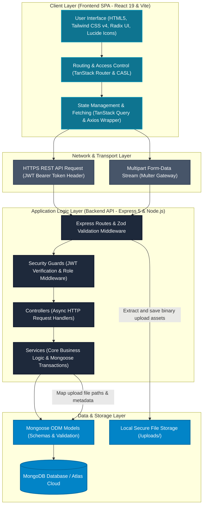

**Project Design Phase-II**  
**Technology Stack (Architecture & Stack)**

| Date | 2 June 2026 |
| :---- | :---- |
| Team ID | SehatMurah Development Team |
| Project Name | SehatMurah - Doctor Appointment MERN Web Application |
| Maximum Marks | 4 Marks |

---

# Technical Architecture

The **SehatMurah Doctor Appointment Platform** is built using a highly decoupled and responsive **3-Tier Client-Server Architecture** utilizing the **MERN (MongoDB, Express, React, Node)** stack with **TypeScript** across both layers. The frontend runs as a single-page application (SPA) optimized with Vite, while the backend operates as a secure **Modular Monolith** to maintain domain boundaries (auth, doctors, appointments, patients, reviews, specialists, users) in a clean, unified codebase.

Below is the detailed visual representation of the system's technical architecture, showcasing the data flows, security boundaries, and layer boundaries.

### Technical Architecture Diagram

*Figure 1: 3-Tier Technical Architecture for SehatMurah.*

---

## Table-1: Components & Technologies

The table below outlines the specific technology choices, structural configurations, and operational roles for each component of the **SehatMurah Doctor Appointment Platform**.

| S.No | Component | Description | Technology |
| :--- | :--- | :--- | :--- |
| **1** | **User Interface** | Responsive, mobile-first client application where patients browse doctors, book slots, and submit reviews; doctors manage schedules and patient queues; and admins audit users and specialists. | HTML5, Tailwind CSS v4, React 19, TypeScript, Vite, Radix UI Primitives, Lucide Icons, Sonner |
| **2** | **Application Logic-1 (Frontend Routing & Caching)** | Handles file-based application routing, route loading indicators, and server state caching to eliminate redundant backend API database requests. | TanStack Router (file-based routing), TanStack Query (server state cache with 5m staleTime, 10m gcTime) |
| **3** | **Application Logic-2 (Frontend Authorization)** | Enforces client-side authorization rules to dynamically hide, show, or lock specific UI navigation and action buttons based on user permissions. | CASL (`@casl/ability`, `@casl/react`) |
| **4** | **Application Logic-3 (Backend Core API)** | Stateless REST API server handling HTTP request routing, database controllers, and transactions in a Modular Monolith folder grouping. | Node.js, Express.js 5, TypeScript |
| **5** | **Application Logic-4 (Data Validation)** | Middleware that intercepts and parses incoming payloads, verifying schema compliance for query strings, body params, and route variables. | Zod, validateRequest middleware |
| **6** | **Database** | Core operational database storing user profiles, active doctor profiles, appointments, reviews, and medical specialist directories. | MongoDB (Local development instances), Mongoose ODM (Object Document Mapper) |
| **7** | **Cloud Database** | High-availability cloud-managed database layer that manages clustering, backup policies, replication, and failover capabilities. | MongoDB Atlas (Cloud deployment configuration) |
| **8** | **File Storage** | Standard file systems for processing and storing uploaded files, such as doctor license uploads, specialist icons, and patient diagnostic PDFs. | Multer middleware, Local File System Storage (Secure routing to private `/uploads/` directory) |
| **9** | **External API / Security** | Integrates password salting techniques and stateless authorization token protocols to secure endpoints across the client-server boundary. | Bcrypt (10 rounds work factor), JSON Web Tokens (JWT) via Authorization Bearer headers |
| **10**| **Infrastructure** | Local development environments and production-ready server targets to run the integrated application. | Local Node server (Vite on port 3000, Express on port 5000), PM2, Docker (Production containers) |

---

## Table-2: Application Characteristics

The table below outlines the core characteristics of the **SehatMurah** architecture, describing how quality attributes, security controls, and performance are implemented.

| S.No | Characteristics | Description | Technology |
| :--- | :--- | :--- | :--- |
| **1** | **Open-Source Frameworks** | Utilizes modern, robust open-source frameworks. The front-end leverages modern React 19, Vite, and TanStack libraries, while the back-end is powered by Express 5 and Node.js to ensure no license bottlenecks. | React 19, Express.js 5, TypeScript, Mongoose, TanStack Router, TanStack Query, Tailwind CSS v4, Zod, CASL, Vitest |
| **2** | **Security Implementations** | Implements multi-layered security controls. Passwords are salted and hashed before database storage; private endpoints are guarded by token authorization middlewares; inactive accounts are blocked via `isActive: false` status; and payload sanitization occurs at the routing boundary. | Bcrypt cryptography, JWT authorization, `authMiddleware`, `roleMiddleware` (ADMIN/DOCTOR/PATIENT), CASL ability guards, CORS and Helmet policies |
| **3** | **Scalable Architecture** | Decoupled client-server design where the backend follows a Modular Monolith pattern (grouped by auth, doctors, appointments, patients, specialists, reviews). The statelessness of the Express application logic allows it to scale horizontally under high loads. | 3-Tier client-server monolith, modular folder design, stateless routing, MongoDB sharding capabilities |
| **4** | **Availability** | Designed to ensure minimal downtime. The stateless backend allows multiple instances to be balanced, while the database relies on active replica sets with automated leader election and instant recovery processes. | PM2 Clustering, NGINX Reverse Proxy load balancing, MongoDB Atlas active replica sets |
| **5** | **Performance** | Optimized for lightning-fast latency. React builds are tree-shaken and compressed by Vite; TanStack Query stores server data locally on the client to avoid duplicate network roundtrips; and MongoDB indexes are placed on key query constraints (e.g., `userId`, availability dates). | Vite compiler, TanStack Query cache management, MongoDB indexing, Gzip/Brotli compression |

---

# References

1. **C4 Model for Software Architecture:** [https://c4model.com/](https://c4model.com/)
2. **Vite Development Tooling:** [https://vitejs.dev/](https://vitejs.dev/)
3. **MongoDB Production Architecture:** [https://www.mongodb.com/cloud/atlas/efficiency](https://www.mongodb.com/cloud/atlas/efficiency)
4. **TanStack Client-Side Caching and Querying:** [https://tanstack.com/query/latest](https://tanstack.com/query/latest)
5. **Express Security Best Practices:** [https://expressjs.com/en/advanced/best-practice-security.html](https://expressjs.com/en/advanced/best-practice-security.html)

---

# Appendix: Diagram and Mockup Image Guidelines

To ensure your final project submission is visually professional, this appendix outlines the step-by-step procedures and design guidelines to draw the **Technical Architecture Diagram** and capture **In-App Mockup Screenshots**.

## 1. Technical Architecture Diagram Drawing Guide

If you need to replace the inline Mermaid text diagram with a professional vector image in your final Word/PDF submission, follow the procedure below:

### Recommended Diagramming Tools
*   **Draw.io (diagrams.net):** Free, open-source, and integrates seamlessly with Google Drive and desktop applications.
*   **Lucidchart:** A premium drag-and-drop diagram tool with excellent team collaboration features.
*   **Figma:** A vector design tool that allows for highly custom, branded technical graphics.

### Standard Design Guidelines (SehatMurah Brand Identity)
*   **Color Palette Harmony:**
    *   *Client-Side components:* Deep Teal (`#0e7490`) with white text to represent a clean, secure portal.
    *   *Backend API components:* Dark Slate (`#1e293b`) with white text to illustrate secure server architecture.
    *   *Storage components:* Light Sky Blue (`#0284c7`) with white text representing data stores.
    *   *Network calls:* Dotted, sleek grey lines (`#475569`) with clear annotations describing request types.
*   **Visual Elements:** Use clear container boundaries to group the layers (Client, Network, Backend, Storage). Keep connection lines straight (orthogonal), avoiding overlapping or diagonal paths that decrease readability.
*   **Export Settings:** Always export your completed diagrams as **lossless PNG** (at `@2x` resolution) or **SVG vector format**. Avoid JPEG format as it compresses details and makes technical text blurry.

---

## 2. In-App Mockup Screenshot Capture Guide

For demonstrating the operational application in user guides or setup documentation, follow these instructions to capture clean, high-impact screenshots:

### Setup & Framing Procedures
1.  **Consistent Resolution:** Open your browser's Developer Tools (F12) and configure the viewport to a standard **16:9 ratio** (e.g., `1280x720` or `1920x1080` pixels). This ensures all screenshots are uniform.
2.  **Clean Viewport:** Disable all browser extensions, bookmark bars, and inspect overlays. Use the browser's incognito window to prevent password manager icons or spelling highlight errors from appearing on screens.
3.  **Clean Seed Data:** Ensure your local database has realistic seed data. Do not capture screenshots with test strings like *"asdfasdf"* or *"test doctor"*. Use realistic names, medical specialties, and clinic addresses to make the application look production-ready.

### Recommended Mockup Enhancements
*   **Adding Drop Shadows:** After capturing, apply a subtle drop shadow (using tools like Figma, Snagit, or online markup software) around the screen border to give it a premium "floating" effect against the white document pages.
*   **Adding Device Frames:** For mobile landing page captures, place the screenshot within a clean vector smartphone frame (like an iPhone wrap) without surrounding hand graphics or background elements.
*   **Naming Conventions:** Save the screenshots inside the local directory (`deliverables/need-to-submit-phase-wise-template/Requirement Analysis/images/`) using consistent snake_case format:
    *   `sehatmurah_arch_diagram.png`
    *   `sehatmurah_landing_page.png`
    *   `sehatmurah_booking_flow.png`
    *   `sehatmurah_admin_dashboard.png`
