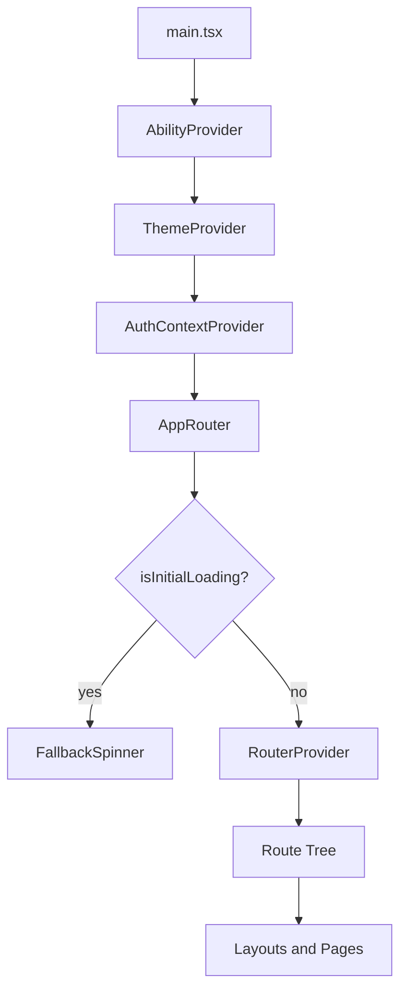

# Frontend Architecture - SehatMurah

Dokumen ini menjelaskan arsitektur teknis aplikasi frontend SehatMurah secara lengkap dan praktis, agar tim bisa mengembangkan fitur baru dengan konsisten, scalable, dan aman.

## 1. Tujuan Arsitektur

- Menjaga pemisahan concern antara UI, domain, state, dan akses API.
- Memastikan alur autentikasi, otorisasi, dan routing tetap konsisten.
- Mempermudah onboarding developer baru.
- Menjadi acuan implementasi fitur dan refactor jangka panjang.

## 2. Ringkasan Teknologi

### Core

- React 19 + TypeScript
- Vite
- TanStack Router (file-based route)
- TanStack Query
- Axios (wrapper JWT service)

### UI dan Styling

- Tailwind CSS v4
- Base UI, Radix UI, custom UI components
- Lucide icons
- Sonner untuk toast

### Form dan Validation

- TanStack Form
- Zod

### Authorization

- CASL (`@casl/ability`, `@casl/react`)

### Tooling

- ESLint + Prettier
- Vitest

## 3. Prinsip Arsitektur

- Feature-oriented: domain utama dipisah per modul (`modules/appointments`, `modules/doctors`, dll).
- Route-driven composition: layout dan akses halaman ditentukan dari route tree TanStack.
- Single source of truth untuk data server: TanStack Query.
- Boundary jelas untuk API: semua request lewat JWT service (`configs/auth/jwt-service.ts`).
- Defense-in-depth untuk akses: route guard + role check + permission check (CASL).

## 4. Struktur Direktori dan Tanggung Jawab

```text
src/
	components/          # Reusable UI dan shared view components
	configs/             # Konfigurasi global (env, api, auth, acl, theme)
	integrations/        # Integrasi library eksternal (tanstack-query, devtools)
	modules/             # Business features per domain
	routes/              # File-based routes dan layout routes
	types/               # Shared type definitions
	utils/               # Utility, hooks, context, helpers
	main.tsx             # Bootstrap app
	router.ts            # Router context dan createRouter
	routeTree.gen.ts     # Auto-generated route tree
	styles.css           # Global styles + design tokens
```

Penjelasan layer:

- `configs/`: hanya untuk konfigurasi, tidak menyimpan business logic page-level.
- `integrations/`: adapter ke library pihak ketiga, sehingga implementasi mudah diganti.
- `modules/`: tempat use case domain (query key, schema, service, ui domain).
- `routes/`: orchestrator halaman, layout, dan proteksi akses.
- `components/`: shared visual building blocks lintas modul.
- `utils/`: utilitas generik, context global, hooks reusable.

## 5. Arsitektur Runtime (Bootstrap)

Alur startup dari `main.tsx`:

1. Membuat root React.
2. Mendaftarkan provider global:
   - `AbilityProvider` (CASL)
   - `ThemeProvider`
   - `AuthContextProvider`
3. Menjalankan `AppRouter`.
4. `AppRouter` membaca auth state (`useAuth`) dan ability (`useAppAbility`).
5. Saat state auth berubah, router di-invalidasi agar guard dan data route re-evaluate.
6. Jika initial auth check belum selesai, tampilkan `FallbackSpinner` fullscreen.
7. Setelah siap, render `RouterProvider` dengan `context`:
   - `queryClient`
   - `auth`
   - `ability`

Diagram runtime:



## 6. Routing Architecture

### 6.1 File-based Route

- Route didefinisikan di `src/routes`.
- `routeTree.gen.ts` digenerate otomatis oleh TanStack Router plugin.
- Jangan edit `routeTree.gen.ts` secara manual.

### 6.2 Layout Segmentation

Layout utama:

- `_layout-public-nav`: halaman publik dengan bottom navigation (home, appointment, booking, profile).
- `_layout-public-blank`: halaman publik tanpa nav tetap.
- `_layout-blank`: layout minimal (misalnya auth).
- `_layout-dashboard`: area dashboard/admin/doctor dengan sidebar.

### 6.3 Route Guard

- Guard umum login menggunakan `requireAuthenticated` di route yang butuh sesi aktif.
- Guard role tambahan di dashboard: hanya role tertentu (`ADMIN`, `DOCTOR`) yang boleh akses.
- Redirect aman lewat `getSafeRedirectTarget` untuk menghindari redirect target tidak valid.

## 7. Authentication dan Authorization

## 7.1 Authentication Flow

Sumber utama ada di `utils/context/auth-context.tsx`:

1. Saat app load, cek token dari storage.
2. Jika ada token, panggil `/auth/me` untuk bootstrap user session.
3. Jika sukses:
   - set `userData`
   - update CASL ability dari permissions backend
4. Jika gagal:
   - clear auth state
   - token dihapus

Login:

- Request ke `/auth/login`.
- Simpan token via `api.setToken`.
- Simpan data user ke state context.
- Update ability dari permissions user.

Logout:

- Hapus token dan user state.
- Reset ability ke permission kosong.

### 7.2 JWT Service dan Interceptor

`configs/auth/jwt-service.ts` mengelola:

- Attach `Authorization` header otomatis saat token tersedia.
- Interceptor `401` handling:
  - Skip retry untuk endpoint login/register/refresh.
  - Retry 1x request setelah refresh session (`/auth/me`).
  - Jika tetap gagal: logout dan reject error.

Tujuan desain ini adalah mencegah infinite loop dan menjaga state auth tetap sinkron.

### 7.3 Authorization dengan CASL

- Ability awal berasal dari `configs/acl/initial-ability.ts`.
- Ability diperbarui runtime berdasarkan permission backend (`user.permissions`).
- Navigation item mendukung properti `permission` untuk filtering berbasis ability.

## 8. Data Fetching dan State Management

### 8.1 Server State (TanStack Query)

`integrations/tanstack-query/root-provider.tsx` menetapkan default:

- `queryFn` global menggunakan `api.get`.
- `staleTime`: 5 menit.
- `gcTime`: 10 menit.
- `refetchOnWindowFocus`: `false`.
- `retry`: 2 kali.

Standar query key:

- Gunakan format array agar mendukung params, contoh: `[endpoint, params]`.
- Endpoint disarankan konsisten dengan resource API (`/doctors`, `/appointments`, dst).

### 8.2 Client State

- Auth state global: `AuthContext`.
- Theme state global: `ThemeProviderContext`.
- UI state lokal (modal, tabs, form draft) disimpan di component/module masing-masing.

Aturan:

- Jangan menyimpan server response besar ke local component state jika bisa dibaca dari query cache.
- Gunakan mutation + invalidation untuk menjaga konsistensi data setelah create/update/delete.

## 9. API Boundary dan Error Handling

API boundary berada di:

- `configs/api-config.ts` (instance service)
- `configs/auth/jwt-service.ts` (transport + auth concerns)
- `utils/api-response.util.ts` (unwrap response)
- `utils/api-error.util.ts` (normalisasi error)

Prinsip:

- Component tidak mengakses Axios langsung.
- Error API dinormalisasi sebelum dipakai UI.
- Toast/error UI harus menampilkan pesan yang user-friendly, bukan raw stack trace.

## 10. UI System dan Theming

### 10.1 Design Tokens

`styles.css` menyimpan token utama:

- Semantic colors (`--background`, `--foreground`, `--primary`, dst)
- Custom accent colors
- Radius, chart tokens, sidebar tokens
- Variant light/dark

### 10.2 Theme Strategy

- Theme dikontrol via class pada root element (`light`/`dark`).
- Sebagian public layout secara eksplisit memaksa `light` untuk menjaga konsistensi visual landing/public flow.

### 10.3 Component Strategy

- `components/ui`: primitive reusable (button, tooltip, sidebar, toaster, dsb).
- `components/forms`: reusable form abstraction.
- `components/layouts`: shell-level components (brand, nav, user nav).
- `components/themes`: toggle/theme controls.

## 11. Feature Module Architecture

Modul domain saat ini:

- `appointments`
- `auth`
- `dashboard`
- `doctors`
- `patients`
- `public-facing`
- `reviews`
- `specialists`
- `users`

Rekomendasi struktur internal modul (target konsistensi):

```text
modules/<feature>/
	components/      # UI khusus feature
	hooks/           # useQuery/useMutation khusus feature
	services/        # adapter API feature
	schemas/         # zod schemas + dto mapping
	types/           # type local feature
	utils/           # helper local feature
```

Aturan dependensi:

- Modul boleh menggunakan `components/ui` dan `utils` shared.
- Modul tidak saling import langsung antar domain jika bisa dihindari.
- Jika ada kebutuhan lintas modul, pindahkan ke `components` atau `utils` shared.

## 12. Security dan Access Control

- Token hanya disimpan di storage key yang dikelola JWT service.
- Route guard menahan akses sebelum auth bootstrap selesai.
- Role guard menutup dashboard untuk role non-authorized.
- Permission guard (CASL) mengontrol visibilitas menu dan aksi UI.

Checklist keamanan frontend:

- Validasi input form dengan Zod sebelum submit.
- Sanitize query params untuk search/filter.
- Hindari menampilkan data sensitif yang tidak diperlukan UI.
- Jangan menaruh secret di `VITE_*` env (hanya public config).

## 13. Environment Configuration

Konfigurasi saat ini:

- `VITE_BASE_SERVER_URL` digunakan untuk:
  - `baseServerUrl`
  - `baseApiUrl` (`/api`)
  - `baseImageUrl`

Praktik yang disarankan:

- Siapkan `.env.development` dan `.env.production`.
- Gunakan nilai fallback local hanya untuk development.
- Tambahkan validasi env di startup (misalnya helper assert env).

## 14. Observability dan Developer Experience

- TanStack Devtools aktif di root document untuk debugging route/query.
- Top loading bar memberi feedback saat perpindahan route/proses async.
- Toaster terpusat untuk notifikasi global.

Konvensi kualitas:

- Lint: `npm run lint`
- Format: `npm run format`
- Check format: `npm run check`
- Test: `npm run test`

## 15. Build, Release, dan Runtime Target

- Development server: `vite dev --port 3000`
- Production build: `vite build`
- Preview artifact: `vite preview`

Alur release minimal:

1. Jalankan lint + test + build.
2. Validasi route penting dan auth flow secara manual.
3. Deploy static bundle ke hosting target.
4. Pastikan `VITE_BASE_SERVER_URL` sesuai environment.

## 16. Decision Log (Current)

- Memakai TanStack Router untuk file-based routing yang typed.
- Memakai TanStack Query untuk server-state sebagai default data layer.
- Memakai CASL untuk authorization karena fleksibel terhadap permission granular.
- Memakai custom JWT service untuk kontrol interceptor dan refresh behavior.

## 17. Tech Debt dan Prioritas Peningkatan

Prioritas tinggi:

- Tambahkan guard level permission per halaman/aksi kritikal selain role/layout.
- Standardisasi struktur internal semua modul domain.
- Tambahkan test untuk auth bootstrap, route guard, dan token refresh path.

Prioritas menengah:

- Tambahkan schema validation untuk env config.
- Pisahkan API endpoint constants agar query key dan route service lebih konsisten.
- Tambahkan error boundary tingkat layout untuk recoverability.

Prioritas jangka panjang:

- Pertimbangkan code splitting lebih agresif untuk halaman dashboard berat.
- Audit aksesibilitas komponen form dan navigasi.
- Tambahkan monitoring frontend (error tracking + performance metrics).

## 18. Ringkasan Implementasi Praktis

Jika menambah fitur baru, ikuti urutan ini:

1. Tambah route dan layout placement yang tepat di `routes/`.
2. Buat modul domain di `modules/<feature>/`.
3. Tambahkan service/query/mutation berbasis `api` + TanStack Query.
4. Pasang validasi schema (Zod) untuk input/output penting.
5. Integrasikan permission CASL untuk menu/aksi yang dibatasi.
6. Tambah feedback UI (loading, empty, error, success).
7. Uji lint/test/build sebelum merge.

Dokumen ini menjadi baseline arsitektur frontend SehatMurah dan harus diperbarui saat ada perubahan besar pada routing, state model, auth model, atau boundary API.
